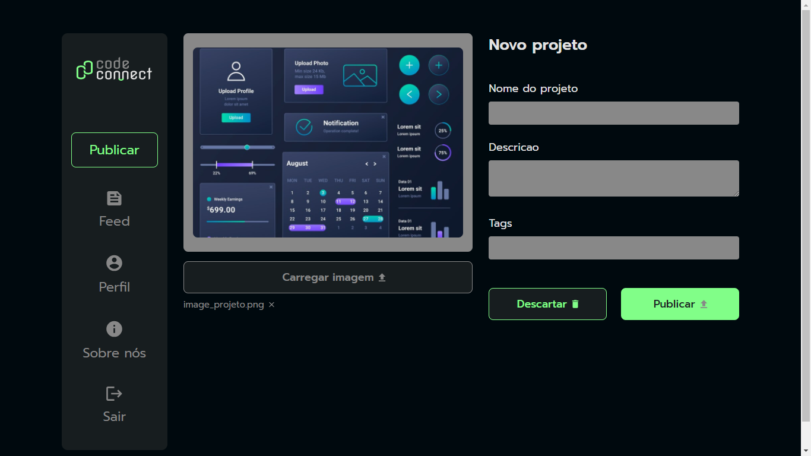

### Projeto CodeConnect: Simulação de Publicação com Pré-Visualização de Imagem

Este projeto consiste em uma **página web** que permite ao usuário carregar imagens e realizar uma **pré-visualização** antes de confirmá-las para o envio. O fluxo principal simula a publicação de um projeto, capturando os dados de um formulário, e utilizando uma função para simular o sucesso ou erro do envio.

---

#### Funcionalidades principais:

- **Carregamento e pré-visualização de imagens**:  
  O usuário pode **selecionar um arquivo** do seu computador e **visualizá-lo** para confirmar se é a imagem correta antes de enviar.
  
- **Simulação de publicação de projeto**:  
  O formulário captura os dados do projeto, e uma função aleatória simula o resultado da publicação, retornando **sucesso ou erro**.

- **Mecanismo de controle de fluxo com `try...catch`**:  
  Utilizei um bloco `try...catch` para tratar os possíveis resultados da simulação, exibindo **mensagens apropriadas** para o usuário, dependendo do sucesso ou falha da publicação.

- **Gerenciamento assíncrono com `async/await`**:  
  Para a execução das funções assíncronas, foi usado `async/await`, permitindo que o código **espere** pela conclusão da função de publicação antes de seguir em frente.

---

#### Comportamento pós-publicação ou descarte:

- **Reset de formulário**:  
  Após a publicação (ou descarte), todos os campos do formulário e a lista de tags são **limpos**.
  
- **Restaurar imagem padrão**:  
  A imagem pré-visualizada e seu nome são **restaurados ao estado inicial**, preparando o formulário para um novo uso. Isso foi implementado com **manipulação direta do DOM** e utilizando a função de reset do formulário.

---

Este projeto demonstra habilidades em:

- Manipulação do **DOM**
- Uso de **funções assíncronas** com `async/await`
- Implementação de **tratamento de erros** com `try...catch`
- Gerenciamento de **estados dinâmicos** (limpeza de campos e pré-visualização)